## Flex 基本概念

 Flex叫弹性布局，叫  **CSS Flexbox（Flexible Box Layout）** 是一个非常常有的前端布局方法。 

主要的作用是 在一条轴上（横轴或纵轴）进行高效的排列元素。 

解决传统 `float`、`inline-block`、`position` 等布局方式难以实现的复杂对齐、分布问题。

常用于 **导航栏、水平/垂直居中、等分布局、自适应容器**。如下图：

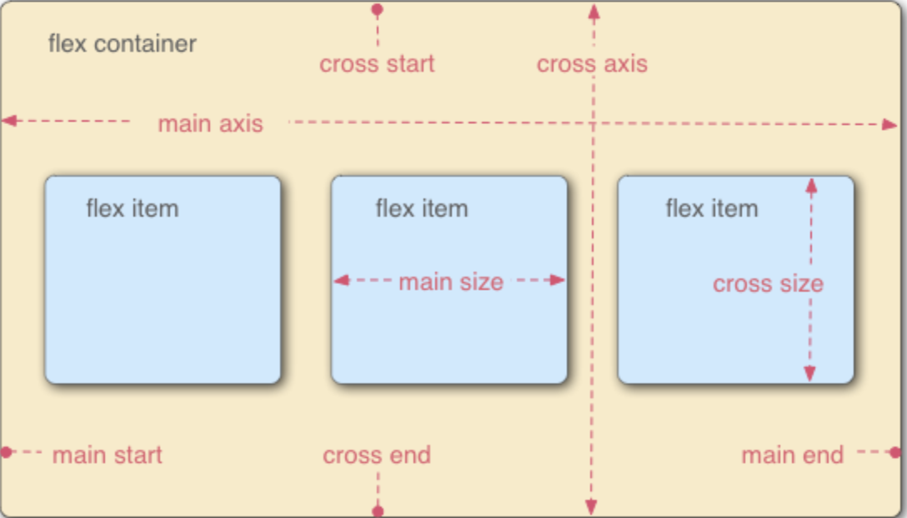


Flex 容器中存在两条轴，水平主轴（main axis）和垂直交叉轴（cross axis），类似于坐标系。 是水平方向为主轴，还是垂直方向为主轴，是可以设置的。（用属性 flex-direction 定义，见下面）

容器中的单元叫做  `flex item`   单元占的主轴的大小是 main size, 占交叉轴的大小 叫 cross size

## Flex  容器

Flex 布局时一定要使用容器 （.container ）如： 

```css 
.container {
    display: flex ;       // 或者 inline-flex 可以有两种取值
}
```

### flex 和inline-flex 的 区别主要在容器本身的表现：

1. **`display: flex`**
   - 容器本身是一个 **块级元素（block-level element）**。
   - 它会像 `div` 一样独占一行，默认宽度会撑满父容器。
   - 常用于大块区域的布局。
2. **`display: inline-flex`**
   - 容器本身是一个 **行内元素（inline-level element）**。
   - 它的外观类似 `span`，可以和其他文字或元素在同一行显示。
   - 常用于需要 **小范围内嵌的弹性布局**，比如按钮组、内联菜单。

容器上可以设置6种属性

1. flex-direction
2. flex-wrap
3. flex-flow
4. justify-content
5. align-items
6. align-content

`flex-direction` 定义主轴的方向

 - `row`（默认）  主轴水平，子项从左到右
 - `row-reverse`  主轴水平，子项从右到左
 - `column`  主轴垂直，子项从上到下
 - `column-reverse`  主轴垂直，子项从下到上

如下图：111

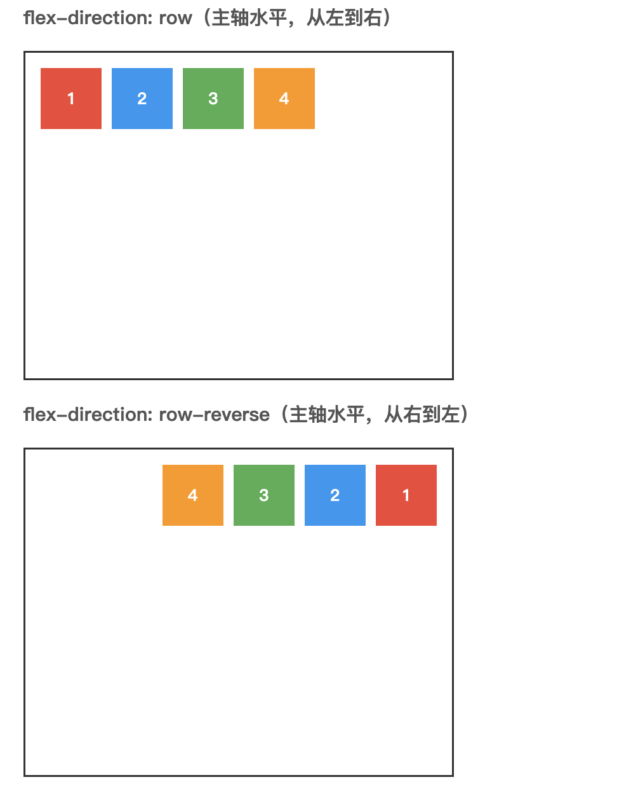

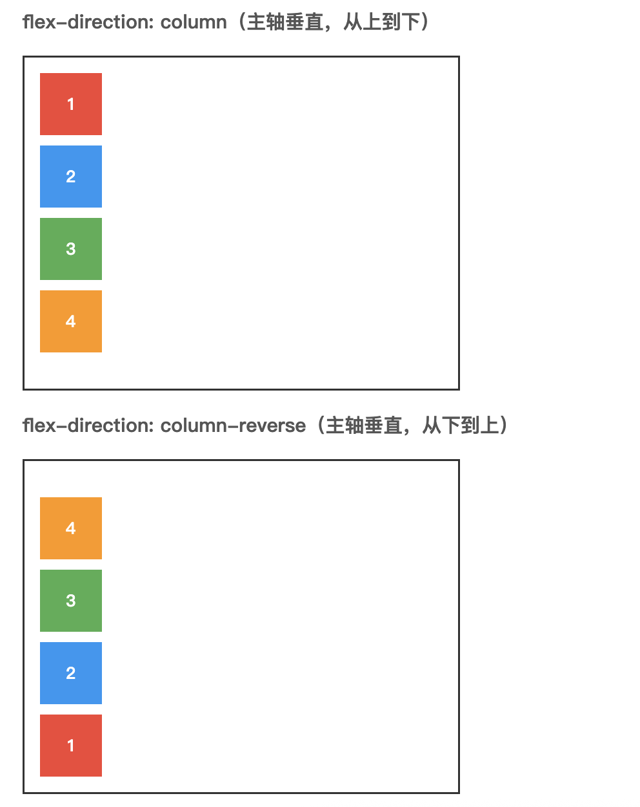

`flex-wrap` 决定容器内项目是否可换行

 - `nowrap`（默认）  不换行，项目会压缩到容器宽度
 - `wrap`  换行，项目会换行显示
 - `wrap-reverse`  换行，项目会从下到上换行显示

如下图：

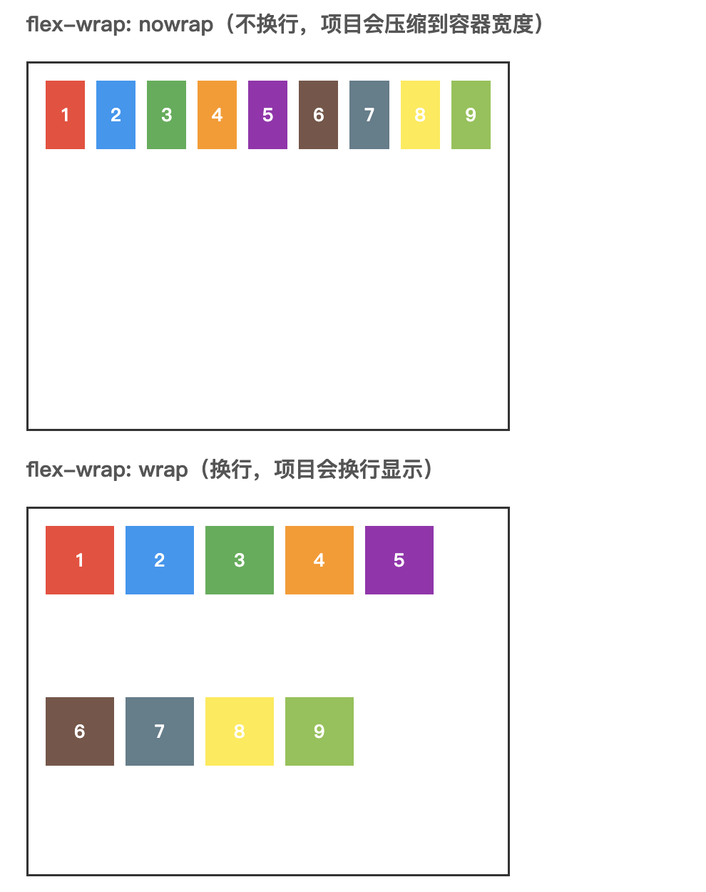

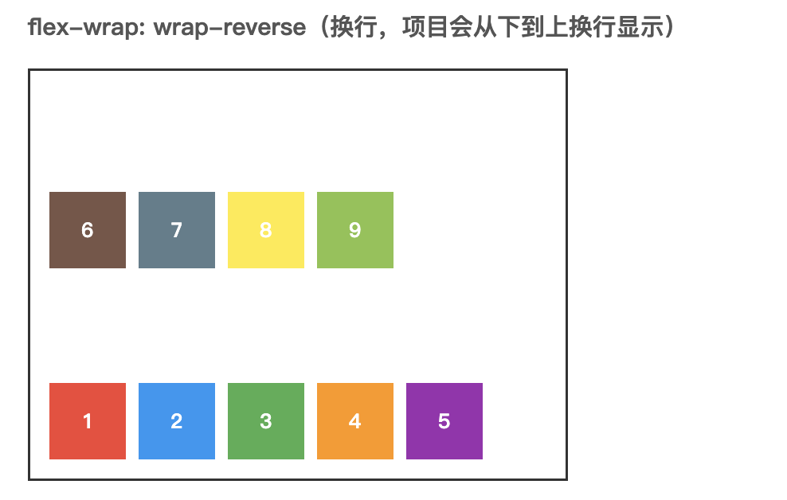


`flex-flow` 是 `flex-direction` 和 `flex-wrap` 的简写形式。

```css
/* 相当于 flex-direction: row; flex-wrap: wrap; */
.container {
  display: flex;
  flex-flow: row wrap;
}
```

`justify-content` 沿主轴（main axis）的对齐方式

- `flex-start`（默认） 靠主轴起点对齐
- `flex-end`  靠主轴终点对齐
- `center`  居中
- `space-between` 两端对齐，子项间距平均分布
- `space-around`  每个子项两侧间距相等（中间大，两边小）
- `space-evenly`  所有间距相等（包含边缘）

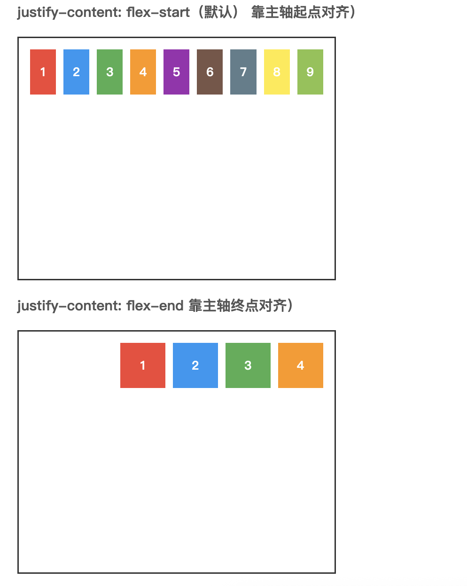

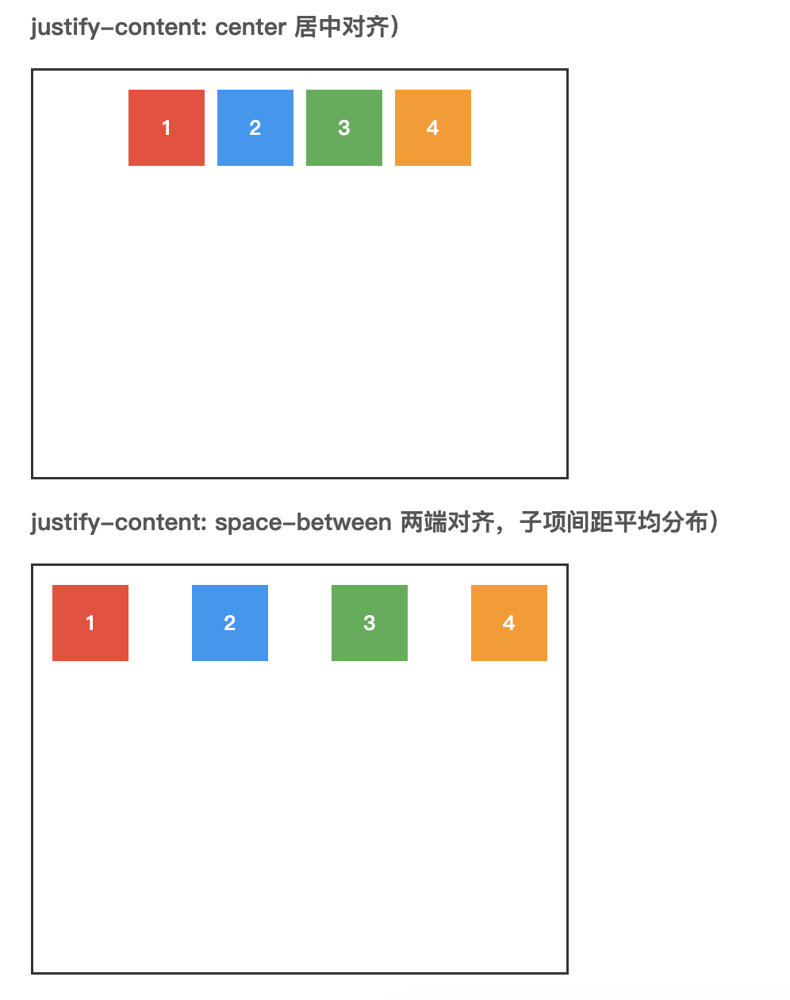

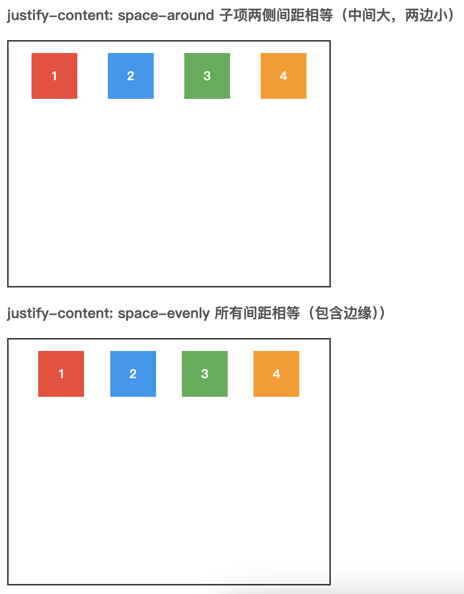

`align-items` 单行时，沿交叉轴（cross axis）的对齐方式。

- `stretch`（默认） 拉伸填满容器
- `flex-start` 靠交叉轴起点对齐（上/左）
- `flex-end` 靠交叉轴终点对齐（下/右）
- `center` 居中
- `baseline` 文字基线对齐

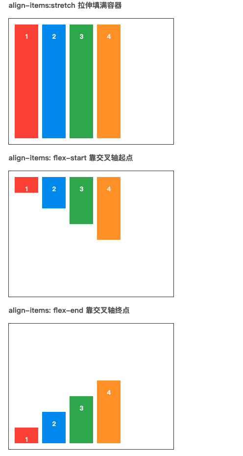


`align-content`多行时，整个内容块在交叉轴上的对齐方式（作用于多行整体）。

 - `stretch`（默认） 各行均匀拉伸填满容器，即不做设置也是填满容器。（在例子中，可以把 `align-items:stretch;` 去掉，效果是一样的）
 - `flex-start` 靠交叉轴起点
 - `flex-end` 靠交叉轴终点
 - `center` 居中
 - `space-between` 两端对齐，行间距平均分布
 - `space-around` 每行上下间距相等
 - `space-evenly` 所有间距（包括边缘）相等

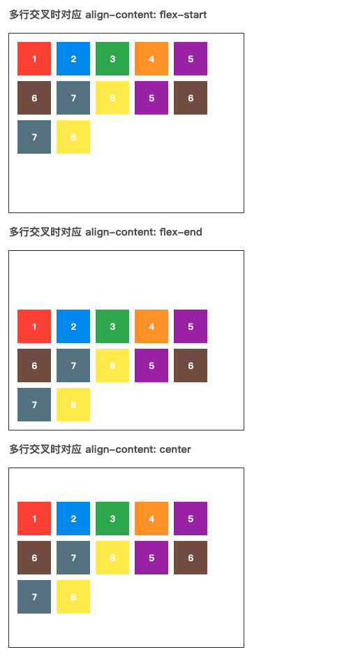

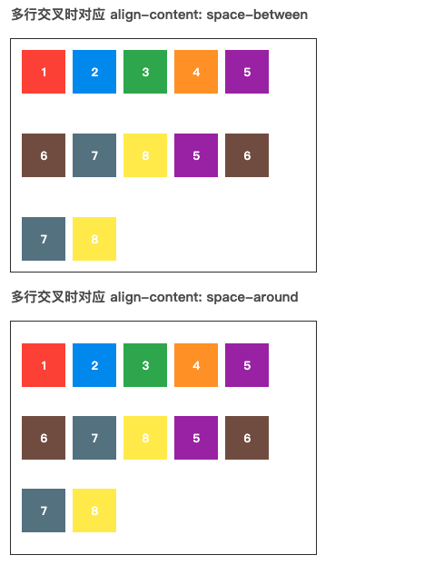

## Flex 项目属性

有六种属性可运用在 item 项目上：

- `order`  定义项目的排列顺序，数值越小越靠前（默认 0）
- `flex-basis`  定义项目的初始大小，默认值为 auto，即项目的本来大小
- `flex-grow`  定义项目的放大比例，默认值为 0，即不放大
- `flex-shrink`  定义项目的缩小比例，默认值为 1，即如果空间不足，该项目将缩小
- `flex`  是 `flex-grow`, `flex-shrink` 和 `flex-basis` 的简写，默认值为 `0 1 auto`
- `align-self`  定义项目在交叉轴上的对齐方式，默认值为 auto，即继承容器的 `align-items` 值


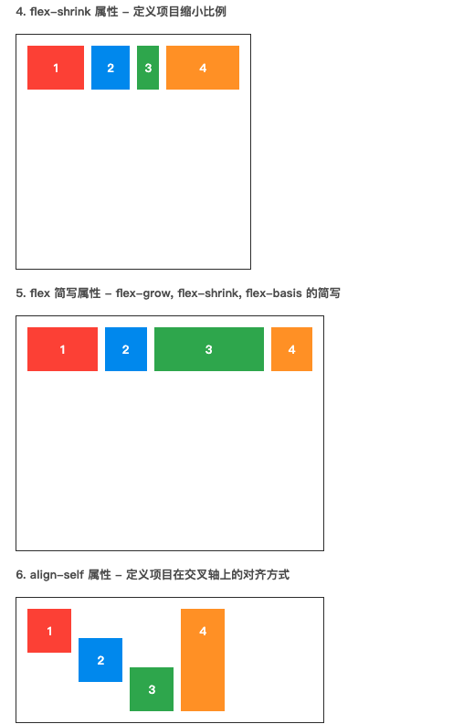


##  学习资源

1、[30 分钟学会 Flex 布局](https://zhuanlan.zhihu.com/p/25303493)