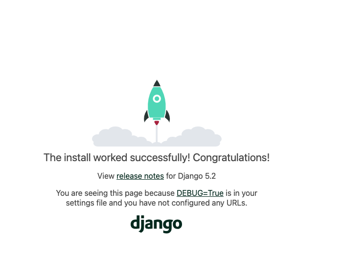
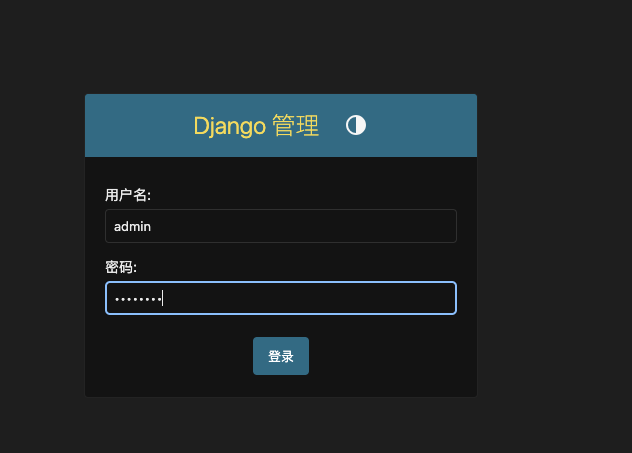
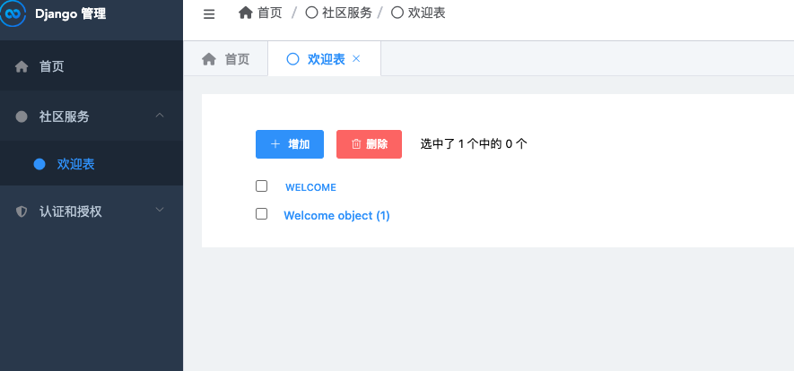

## django 学习笔记

文档：[django 官方文档](https://docs.djangoproject.com/zh-hans/5.2/intro/tutorial01/)

我所用的 环境是 mac, 用的是 python 3.10.10 版本。


## 安装 django

创建虚拟环境 

```bash
python -m venv .venv

# 激活虚拟环境
source .venv/bin/activate
```

安装 django

```bash
pip install django

python -m django --version # 查看 django 版本
```

## 创建项目

创建一个叫 `community_service` 的项目

```bash
django-admin startproject community_service 

cd ommunity-service 
python manage.py runserver

```
报了一个错：不能用 `-` 作为项目名
```bash 
CommandError: 'community-service' is not a valid project name. Please make sure the name is a valid identifier.
```
访问： http://127.0.0.1:8000/




## 配置改造

配置都发在 在 settings.py 中，

```py
from pathlib import Path

# 项目根目录的绝对路径，使用 Path(__file__).resolve().parent.parent 计算得出，用于构建项目内的其他路径。
BASE_DIR = Path(__file__).resolve().parent.parent

# Django 的密钥，用于加密签名、会话等。这是一个安全敏感项，生产环境中不应该直接硬编码在代码中。
SECRET_KEY = 'django-insecure-(ztmu$^a1-_nu$-3+$p&^5-u8lzk6rogpybg^0a8z9chbbvdg!'

# 调试模式开关，设置为 True 表示开启调试模式，会显示详细的错误信息。生产环境应设为 False 。
DEBUG = True

# 允许访问该 Django 站点的主机/域名列表，当 DEBUG=False 时必须设置。目前为空列表，表示只允许本地访问。
ALLOWED_HOSTS = []


# INSTALLED_APPS : 项目中启用的 Django 应用列表，每个应用都是一个独立的模块，负责处理特定的功能。
INSTALLED_APPS = [
    'django.contrib.admin', # 管理后台
    'django.contrib.auth',  # 认证系统，包括用户、组、权限等。
    'django.contrib.contenttypes', # 内容类型框架，用于关联模型和权限。
    'django.contrib.sessions', # 会话框架，用于存储用户会话数据。
    'django.contrib.messages', # 消息框架，用于在视图之间传递消息。
    'django.contrib.staticfiles', # 静态文件框架，用于管理项目的静态文件（如 CSS、JavaScript、图像等）。
]

# Django 的中间件列表，按顺序处理请求和响应：

MIDDLEWARE = [
    'django.middleware.security.SecurityMiddleware',  # 安全中间件，用于设置安全相关的 HTTP 头。
    'django.contrib.sessions.middleware.SessionMiddleware', # 会话中间件，用于处理用户会话。
    'django.middleware.common.CommonMiddleware', # 通用中间件，处理一些通用的请求和响应任务，如处理静态文件、处理重定向等。
    'django.middleware.csrf.CsrfViewMiddleware', # CSRF 中间件，用于处理跨站请求伪造保护。
    'django.contrib.auth.middleware.AuthenticationMiddleware', # 认证中间件，用于将用户与请求关联起来。
    'django.contrib.messages.middleware.MessageMiddleware', # 消息中间件，用于在视图之间传递消息。
    'django.middleware.clickjacking.XFrameOptionsMiddleware', # 点击劫持保护中间件，用于设置 X-Frame-Options 头。
]


# 指定根 URL 配置模块的路径，这里是 community_service.urls ，用于定义项目的 URL 路由。
ROOT_URLCONF = 'community_service.urls'

# 模板配置
TEMPLATES = [
    {
        'BACKEND': 'django.template.backends.django.DjangoTemplates', # 使用的模板引擎 
        'DIRS': [], # 模板查找目录列表
        'APP_DIRS': True, # 是否在应用的 templates 目录中查找模板
        'OPTIONS': { # 模板引擎的选项，包括上下文处理器
            'context_processors': [
                'django.template.context_processors.request',
                'django.contrib.auth.context_processors.auth',
                'django.contrib.messages.context_processors.messages',
            ],
        },
    },
]

# 指定 WSGI 应用的路径，用于部署，这里是 'community_service.wsgi.application'
WSGI_APPLICATION = 'community_service.wsgi.application'


# 数据库配置
DATABASES = {
    'default': {
        'ENGINE': 'django.db.backends.sqlite3', # 数据库引擎，这里是 SQLite 数据库
        'NAME': BASE_DIR / 'db.sqlite3', 
    }
}


# Password validation
# https://docs.djangoproject.com/en/5.2/ref/settings/#auth-password-validators

# 密码验证配置
AUTH_PASSWORD_VALIDATORS = [
    {
        'NAME': 'django.contrib.auth.password_validation.UserAttributeSimilarityValidator',
    },
    {
        'NAME': 'django.contrib.auth.password_validation.MinimumLengthValidator',
    },
    {
        'NAME': 'django.contrib.auth.password_validation.CommonPasswordValidator',
    },
    {
        'NAME': 'django.contrib.auth.password_validation.NumericPasswordValidator',
    },
]


# 国际化配置
LANGUAGE_CODE = 'zh-hans'  # 语言代码，这里是英语（美国）
TIME_ZONE = 'Asia/Shanghai' # 时区，这里是东八区（中国上海）
USE_I18N = True # 是否启用国际化，设置为 True 表示启用
USE_TZ = True # 是否启用时区支持，设置为 True 表示启用

# 静态文件配置
STATIC_URL = 'static/'

# Default primary key field type
# https://docs.djangoproject.com/en/5.2/ref/settings/#default-auto-field

# 默认主键字段类型配置
DEFAULT_AUTO_FIELD = 'django.db.models.BigAutoField'
```
其中数据库配置可以为：

- sqlite3
- mysql/mariadb 
- postgresql
- oracle

## 创建 model 数据模型 

1、创建模型类

```python
from django.db import models

# 要安装 pillow 库，用于处理图片 支持上传文件
# pip install pillow

class  Welcome(models.Model):
    img = models.ImageField(upload_to='welcome', default='bg/welcome.png')
    order = models.IntegerField(default=0)
    is_deleted = models.BooleanField(default=False)
    create_time = models.DateTimeField(auto_now_add=True)
 
    # 元数据类，用于配置模型的元数据，如数据库表名、 verbose_name_plural 等
    class Meta:
        verbose_name_plural = '欢迎表'
```

2、添加到 settings.py 中的 INSTALLED_APPS 中

```python
INSTALLED_APPS = [
    ...
    'community_service',
]
```

2、数据迁移，即把数据写入数据库中

```bash 
python manage.py makemigrations
python manage.py migrate
```
3、确认是否已经创建了数据库表

```bash
sqlite3 db.sqlite3
.tables
```
查看是否有 community_service_welcome 表

## 开启 media 静态文件访问

在 setting.py 开启，添加两代码

```python 
# 媒体文件配置
MEDIA_URL = '/media/'
MEDIA_ROOT = os.path.join(BASE_DIR, 'media')

```

在根目录下创建 media 目录，用于存储上传的文件。

在 urls.py 中添加路由代码,

```python
from django.contrib import admin
from django.urls import path
from django.conf import settings
from django.conf.urls.static import serve

urlpatterns = [
    path('admin/', admin.site.urls),
    path('media/<path:path>', serve, {'document_root': settings.MEDIA_ROOT}),
]
```

然后就可以访问这个路径：`http://127.0.0.1:8000/media/welcome001.png`


## 创建超级管理帐号 

创建一个超级管理帐号，用于管理项目。

```bash
python manage.py createsuperuser --username admin --email admin@example.com
```
然后输入密码即可。如 12345678 

访问  `http://127.0.0.1:8000/admin/`



配置数据库表可见 

1、创建 admin.py 文件 
2、添加以下代码

```python
from django.contrib import admin
from .models import Welcome

admin.site.register(Welcome)
```

## 美化admin管理界面

用 simpleui 美化 admin 管理界面

1、安装 simpleui 库 

simpleui 文档：[https://newpanjing.github.io/simpleui_docs/](https://newpanjing.github.io/simpleui_docs/)


```bash
pip install django-simpleui
```

2、添加到 settings.py 中的 INSTALLED_APPS 中

```python
INSTALLED_APPS = [
    ...
    'simpleui',
]
```

3、配置 simpleui 主题

```python
# 配置 simpleui 主题
SIMPLEUI_DEFAULT_THEME = 'dark.css'
```

4、重启项目

```bash
python manage.py runserver
```

访问 `http://127.0.0.1:8000/admin/` 即可看到美化后的界面。

如图：



## 添加接口

1、创建 views.py 文件 

2、写接口函数 

```python 
from .models import Welcome

from django.http import JsonResponse

def welcome(request):
    # 查询出 order 最大的一个记录
    resp = Welcome.objects.all().order_by('-order').first()
    img = 'http://127.0.0.1:8000/media/' + str(resp.img)
    return JsonResponse({'code': 200, 'msg': '成功', 'result': img})

```
3、定义路由

```python
from . import views
urlpatterns = [
    path('admin/', admin.site.urls),
    path('community/welcome/', views.welcome, name='welcome'),
    path('media/<path:path>', serve, {'document_root': settings.MEDIA_ROOT}),
]

```

访问 `http://127.0.0.1:8000/community/welcome/` 成功返回图片路径，但是存在乱码。 

```json
{"code": 200, "msg": "\u6210\u529f", "result": "http://127.0.0.1:8000/media/welcome/welcome002.png"}
```
