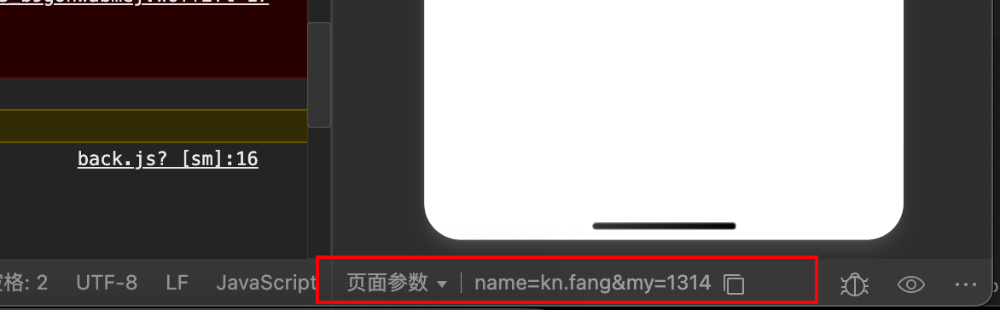

官方文档：  https://developers.weixin.qq.com/miniprogram/dev/framework/quickstart/

B站 视频： https://www.bilibili.com/video/BV1EFcve9EH1/

## 文件目录说明

```sh 
.
├── app.js        # 小程序入口文件，小程序启动，会执行这个 js
├── app.json      #  小程序的全局配置：顶部的颜色，标题。。。
├── app.wxss.     #  小程序全局样式：所有样式，全局生效
├── components    # 页面中使用的组件
│   └── post-card
│       ├── post-card.js
│       ├── post-card.json
│       ├── post-card.wxml
│       └── post-card.wxss
├── images
├── pages.             # 文件夹下，有一个个的文件夹（index,login,register）--> 每个文件夹下有 4 个文件
│   └── profile
│       ├── profile.js         # 页面逻辑，js 代码控制
.        ├── profile.json      # 页面配置，当前页面顶部颜色，标题。。
│       ├── profile.wxml       # 页面结构，布局，html--->wxml 就等同于 html，但标签有些区别
│       └── profile.wxss       # 页面的样式，如果全局样式也有，以当前页面为准
├── project.config.json.       # 开发者工具默认配置
├── project.private.config.json # 开发者工具用户配置，在这里修改，优先用这个，可以删除
├── README.md
├── sitemap.json. # 微信收录页面，用于搜索，上线后，搜索关键字就可以搜到我们
└── utils
    └── util.js.  # 自定义工具
```

## 配置文件

`app.json`  的全局配置： https://developers.weixin.qq.com/miniprogram/dev/reference/configuration/app.html


项目配配置 `project.config.json`

搜索相关的配置，eso 配置  在 sitemap.json 文件 配置

作用： 

微信开放小程序内搜索后，开发者可通过 `sitemap.json` 配置或管理后台开关，决定小程序页面是否允许微信索引。若允许，微信会用爬虫（携带特定 `user - agent: mpcrawler` 和场景值 1129）为页面内容建索引，当用户搜索词条触发索引，页面可能出现在搜索结果里；但要是爬虫发现页面数据和真实用户看到的不一致，该页面就不会被索引。

所有的页面都需要进行被微信小程序的爬虫进行爬取 ： 

```json
{
  "rules":[{
    "action": "allow",
    "page": "*"
  }]
}
```

禁止爬取 `path/to/page` 这个页面的 SEO 内容：

 ```json
 	{
  "rules":[{
    "action": "disallow",
    "page": "path/to/page"
  }]
}
 ```


首先是所有页面都是禁止爬取的，然后，单独对 `path/to/page` 这个页面进行了开放爬虫爬取的权限 : 

```json 
{
  "rules":[{
    "action": "allow",
    "page": "path/to/page"
  }, {
    "action": "disallow",
    "page": "*"
  }]
}
```

##  webview 渲染和纯净项目

###   webview 渲染模式 和 skyline 渲染模式

webview 比较老，但是新老版本都支持。

skyline 只支持新的版本，拥有更接近原生渲染的性能体验。 

在项目中配置， 如何把 skyline 转成 webview  模式？ 在配置中把  skyline 的相关配置删除。 

## 新增页面 

在 pages 新增文件夹， 再新建 page  会新建出4个文件如下： 

会在 app.json  自动创建一行。 

 

 新增的另一种方式， 在 app.json 新装置一行 如  `"pages/me/me"`  会自动创建一个页面。 

```json
"pages": [
"pages/index/index",
"pages/logs/logs",
"pages/me/me"
],
```

## 启动页面的调整

1、 在 app.json 中的 pages 中调整顺序，把想放在启动面的页面，放在第一个。 

2、 在  app.json. 中 配置 entryPagePath 

```json
{
  "entryPagePath": "pages/index/index"
}
```

见 [小程序 全局配置](https://developers.weixin.qq.com/miniprogram/dev/reference/configuration/app.html)

3、临时设置启动页面 ， 编译-> 添加编译模式-> 设置启动页面

这种方式是临时的，方便调试，打包后 ，还是以配置主准

## 纯净项目的 

app.json

```json 

{
  "pages": [
    "pages/index/index" # 就一个页面
  ],
  "window": {
    "navigationBarTitleText": "功能演示", # 标题
    "navigationBarBackgroundColor": "#0000FF", # 颜色
    "enablePullDownRefresh": false, # 是否带下拉刷新
    "backgroundColor": "#00FFFF", # 下拉刷新颜色
    "backgroundTextStyle": "dark" # light，下拉刷新的点点什么颜色
  },
  "style": "v2",
  "sitemapLocation": "sitemap.json",
  "lazyCodeLoading": "requiredComponents"
}

```

##  小程序常用组件

[小程序组件](https://developers.weixin.qq.com/miniprogram/dev/component/)

##  tabbar 配置

几乎所有的小程序都有 tabbar 


1 在app.json 配置 : 

 ```json
"tabBar": {
  "selectedColor": "#b4282d",
  "position": "bottom",
  "list": [
    {
      "pagePath": "pages/index/index",
      "text": "首页",
      "iconPath": "images/home.png",
      "selectedIconPath": "images/home_select.png"
    },
    {
      "pagePath": "pages/my/my",
      "text": "我的",
      "iconPath": "images/my.png",
      "selectedIconPath": "images/my_select.png"
    }
  ]
},

 ```

## 尺寸单位 

一些矢量图 : [https://www.aigei.com/icon/class/user](https://www.aigei.com/icon/class/user)

微信小程序对图标有严格的大小限制，每个图标文件不能超过 40KB。

小程序中 手机屏幕的大小可能不一样，直接使用 px 像素就有有问题， 所以小程序统一了整个宽度就是750rpx, 这样无论在什么手机上都能等比缩放 

所以高度和宽度都用 rpx .

## 页面样式

小程序的样式是 是写在  *.wxss 里

- 全局样式  app.wxss 
- 局部样式  页面.wxss 

把 样式写在 *.wxml  是不被推荐的， 应该在写在 .wxss 中, 如： `index.wxml `

```xml 
<text>首页</text>

<view style="height: 300rpx; width: 750; background-color: pink;" ></view>
```


一个样式，会先在自已的页面文件夹中找，如果没有就在全局的样式中找。如： 

```xml
<!--pages/my/my.wxml-->

<text>pages/my/my.wxml</text>

<view class= "myfirstview"></view>
```

`myfirstview`  会在 my 目录下的 my.wxss 中找，没有就在到 app.wxss中找。 


## 内置组件

把 鼠标放在组件上，就可以从下面的 “微信开放文档” 打开微信的所有 内置组件。 

微信官方文档： [https://developers.weixin.qq.com/miniprogram/dev/component/icon.html](https://developers.weixin.qq.com/miniprogram/dev/component/icon.html)


**比较重点的组件** 

- text  对应  span 
- view  对应 div 
- image  对应 img 
- icon  提示
- button 

## button  组件

```xml

<button size="mini" type="default"> 第一个按钮 </button>
<button size="mini" type="warn">第二个按钮</button>
<button size="mini" type="primary">第三个按钮</button>
<button size="mini" type="primary" loading>第四个按钮</button>
<button size="mini" type="primary" plain>第五个按钮</button>
<button size="mini" type="primary" disabled>第五个按钮</button>
```

button 可以通过标签选择器更改模式。 

``` css
button{
    /*距离顶部 30rpc */
	margin-top: 30rpx;
	 /*距离底部 30rpc */
	margin-bottom: 30rpx;
}

.button-sp-area{
	margin: 0 auto;
	width: 60%;
}

.mini-btn{
	margin-right: 10rpx;
}
```

见文档： [https://developers.weixin.qq.com/miniprogram/dev/component/button.html](https://developers.weixin.qq.com/miniprogram/dev/component/button.html)

## 滑块视图容器 

swiper 和 swipter_item

[https://developers.weixin.qq.com/miniprogram/dev/component/swiper.html](https://developers.weixin.qq.com/miniprogram/dev/component/swiper.html)

```xml
<!--pages/swiper/swiper.wxml-->

<swiper autoplay indicator-dots interval="5000" >

	<swiper-item>
		<image src="/images/banner/151-image-2.png" mode="widthFix"/>
	</swiper-item>

	<swiper-item>
		<image src="/images/banner/151-image-3.png" mode="widthFix"/>
	</swiper-item>

	<swiper-item>
		<image src="/images/banner/151-image-2.png" mode="widthFix"/>
	</swiper-item>

</swiper>
```


## flex 布局

什么时 flex 布局？ 

学习笔记我我放到别文档中了。
见[前端flex布局学习.md](https://github.com/fangkn/tech-frontend-note/blob/main/%E5%89%8D%E7%AB%AFflex%E5%B8%83%E5%B1%80%E5%AD%A6%E4%B9%A0.md)

 

index.wxml

```html
  

<view class="menu">
	<view class="item">
		<image src="/images/item/firtst.png" class="img"></image>
		<text class="title">首页</text>
	</view>

	<view class="item">
		<image src="/images/item/activity.png" class="img"></image>
		<text class="title">活动</text>
	</view>

	<view class="item">
		<image src="/images/item/context.png" class="img"></image>
		<text class="title">合同</text>
	</view>
	
	<view class="item">
		<image src="/images/item/admin.png" class="img"></image>
		<text class="title">管理</text>
	</view>

	<view class="item">
		<image src="/images/item/list.png" class="img"></image>
		<text class="title">表格</text>
	</view>

	<view class="item">
		<image src="/images/item/setting.png" class="img"></image>
		<text class="title">设置</text>
	</view>

	<view class="item">
		<image src="/images/item/area.png" class="img"></image>
		<text class="title">区域 </text>
	</view>

	<view class="item">
		<image src="/images/item/me.png" class="img"></image>
		<text class="title">人员</text>
	</view>

</view>
```


index.wxss

```css

/* flex 布局 */

.menu{

display: flex;
justify-content: space-between;
padding: 16rpx;
border-radius: 10rpx;
flex-wrap: wrap
/*background-color: powderblue;*/

}

.item{

display: flex;
flex-direction: column;
justify-content: center;
align-items: center ;
width: 150rpx;
height: 200rpx;
margin: 1rpx;

/*background-color: powderblue; */

}

.img{

width: 110rpx;
height: 88rpx;
border-radius: 10rpx;

}
```

## 通知布局

index.wxml
```html
<view class="notice">
	<image src="/images/home/notice.png" mode="aspectFit" style="width: 200rpx; height: 100rpx"/>
	<text>通知公告:世界无产阶级万岁</text>
</view>
```

index.wxss
```css
  

.notice{

	display: flex;
	justify-content: flex-start;
	margin-top: 10rpx;
	margin-bottom: 10rpx;
}

.notice>text{
	flex-grow: 1;
	font-size: 40rpx;
}

```


## 底部布局

 

```html
  
<view class= "bottom">

	<view>
		<image src= "/images/home/scene_001.png" mode="scaleToFill"/>
	</view>

	<view>
		<image src= "/images/home/scene_002.png" mode="scaleToFill"/>
	</view>

	<view>
		<image src= "/images/home/scene_003.png" mode="scaleToFill"/>
	</view>

	<view>
		<image src= "/images/home/scene_004.png" mode="scaleToFill"/>
	</view>
</view>
```
```css

.bottom{

	display: flex;
	justify-content: space-between;
	flex-wrap: wrap;

}

.bottom>view>image{

	width: 345rpx;
	padding: 10rpx;
	height: 200rpx;

}
```

## 引入矢量图

可以选择了阿里 矢量图， 地址： [https://www.iconfont.cn/](https://www.iconfont.cn/)

1、注册帐号
2、搜索选择你想要的矢量图，添加放库
3、创建一 个项目， 如 : demo-00001 
4、选择 front class 后 点击生成代码，从链接中打开代码，复制代码
5、把css 代码放到自己的小程序项目中
6、可以选择生成 base64 的方式 ，这样不用远程下载icon 


```css
/**app.wxss**/
@import "./static/css/font.wxss" ;
```

如下图 ： 


 

 

 

如何引用矢量图 ？

把代码放到合适的目录下，然后在 app.wxss 引入

```css 
@import "./static/css/font.wxss" ;

```

就可以在 wxml 中使用了， `class ="iconfont icon-tishi"`

```xml
<view class="tips">
<text class ="iconfont icon-tishi icon"> </text>
<text>欢迎来道我们的世界</text>

</view>
```


## 事件绑定

如点击时会触发 一个事件。

如 按钮， 在点击之后，会触发一个事件， 请求后端数据等， 

例子：

在 wxml  中

```html
<view> 事件绑定：</view>

<button type="warn" plain size= "mini" bind:tap="handleConsole"> 点击控制台打印 </button>
```

在 js 中

```js
Page({

handleConsole(){ 
console.log("有点击事件产生了--------")

}

})
```

`bind:tap="handleConsole"` 可以写成 `bindtap="handleConsole"`


## 事件冒泡

有一个父组件，套了一个子组件。 

 - 子组件有事件
 - 父组件也绑定了事件

点击子组件时产和的事件，父组件也会被触发事件。 

不要用 bind:tap 去绑定， 而是要用 catch:tap 去绑定。 

例子： 

```html 
  

<view style= "height: 200rpx; width: 750rpx; background-color:bisque;display: flex; justify-content: center;align-items: center;" bind:tap="handleParent">

<button type="primary" plain bind:tap="handleChildren">冒泡了</button>
<button type="primary" plain catch:tap="handleChildren">Stop冒泡了</button>

</view>
```

js 代码

```js
  
handleParent(){

	console.log("有点击事件产生了--------Parent")

},


handleChildren(){

	console.log("有点击事件产生了--------children")

}
```


## 事件对象 

绑定对象之后 ，函数是可以接受一个参数：事件对象 （event） 

例子：

```html 
<view> 事件参数：</view>

<button type="primary" plain size= "mini" bind:tap="handleClick02" data-id='1001' data-name='kn.fang'> 点击传参02 </button>
```

 ```js
 handleClick02(event){

	console.log(event.target.dataset)
	console.log(event.target.dataset.name) // 将正确显示 'kn.fang'
	console.log(event.target.dataset.id)

}
 ```


## 页面跳转

组件跳转 （声明式导航）

1、navigator 组件   这种方式的页面不能是是 tabBar， 如果是，则跳转会失败。

`open - type`属性的几种页面跳转方式：
- `navigate`（默认）：保留当前页面，跳转到应用内的某个页面，但不能跳到`tabbar`页面。
- `redirect`：关闭当前页面，跳转到应用内的某个页面，也不能跳转到`tabbar`页面。
- `switchTab`：专门跳转到`tabBar`页面，并且会关闭其他所有非`tabBar`页面。
- `reLaunch`：关闭所有页面，然后打开应用内的某个指定页面。
- `navigateBack`：关闭当前页面，返回上一页面或者多级页面。

```html
  
<view> 组件跳转01： </view>

<navigator url="/pages/admin/admin">
	<button type="primary" plain>admin</button>
</navigator>


<view> 组件跳转02： </view>

<navigator url="/pages/my/my" open-type="switchTab">
	<button type="primary" plain>我的</button>
</navigator>

```

在微信小程序中，如果目标页面已经在tabBar中配置，使用navigator组件默认的navigate方式是无法跳转的。因为tabBar页面有特殊的跳转机制。

解决方法是在navigator组件中指定open-type为"switchTab"：

跳转携带参数

```html
<navigator url="/pages/back/back?name=kn.fang&my=1314" >
	<button type="primary" plain>带参数跳</button>
</navigator>
```

```js
onLoad(options) {
	console.log(options)
},
```

可以在下面看到路径uri 的参数 

 

js 跳转 (编程式导航)

1、使用 js 控制跳转, 5个方法，对应面5个参数

```js

 handlenavigateTo(){
   wx.navigateTo({
     url: '/pages/back/back',
   })
 },

 handleredirectTo(){
  wx.redirectTo({
    url: '/pages/back/back',
  })
},

handleswitchTab(){
  wx.switchTab({
    url: '/pages/my/my',
  })
},

handlereLauch(){
  wx.reLaunch({
    url: '/page/back/back',
  })
},

handlenavigateBack(){
  wx.navigateBack()({
    url: '/page/admin/admin',
  })
},
 
```

```html

<view> ===== 页面跳转：编程式 ====== </view>

<button type="default" bind:tap="handlenavigateTo">handlenavigateTo</button>
<button type="warn" bind:tap="handleredirectTo">handleredirectTo</button>
<button type="primary" bind:tap="handleswitchTab">handleswitchTab</button>
<button type="default" bind:tap="handlereLauch">handlereLauch</button>
<button type="warn" bind:tap="handlenavigateBack">handlenavigateBack</button>
```

## wxml 语法


模板语法

1. 页面的js 中定义一些变量 
2.  在 mxml 使用

```js
Page({

  /**
   * 页面的初始数据
   */
  data: {
    name :"kn.fng",
    age : 18,
    sex : "男",
    email : "kn.fng@gmail.com",
    phone : "13800000000",
    address : "中国 北京",
    
    userinfo:{
      name :"刘亦菲",
      age : 18,
      sex : "女",
      email : "liuyifei@gmail.com",
      phone : "13800000000",
      address : "中国 北京",
    }

  },
})

```
```html
<!--pages/my/my.wxml-->
<text>模板语法：我的信息</text>

<view>
  <view>名字：{{name}}</view>
  <view>年龄：{{age}}</view>
  <view>性别：{{sex}}</view>
  <view>电子邮件：{{email}}</view>
  <view>电话：{{phone}}</view>
  <view>地址：{{address}}</view>
</view>

<view>
  <view>刘亦菲信息显示</view>
  <view>名字是：{{userinfo.name}}</view>
  <view>年龄：{{userinfo.age}}</view>
  <view>性别：{{userinfo.sex}}</view>
  <view>电子邮件：{{userinfo.email}}</view>
  <view>电话：{{userinfo.phone}}</view>
  <view>地址：{{userinfo.address}}</view>
</view>

```

如果在 js 中改了数据，需要调用 `this.setData` 方法来更新页面的显示。把对象作为参数传递给 `this.setData` 方法。

```js
// 假设在 js 中修改了 name 变量
this.setData({
  name: '新的名字'
})
```


## 发送网络包

小程序请求后端服务的接口的域名一定在小程序后台配置。 本地环境，只适用于开发和体验。 

要求要用域名。 

域名的配置在 ：


微信发送网络请求

```js
wx.request({
  url: 'http://127.0.0.1:8000/index/',
  method: 'GET',
  data: {},
  header: {},
  success: (res) => {
    // 成功回调逻辑
  },
  fail: (error) => {
    // 失败回调逻辑
  },
  complete: (res) => {
    // 关闭加载
    wx.hideLoading()
  }
})

```
显示 loading 提示框

```js
# 显示
wx.showLoading({
    title: '加载中，稍后',
    mask: true  // 显示透明蒙层
})

# 关闭--必须手动关闭
wx.hideLoading()
```


## 对话框
 
  模态对话框
  消息对话框

 ## 存储数据 


