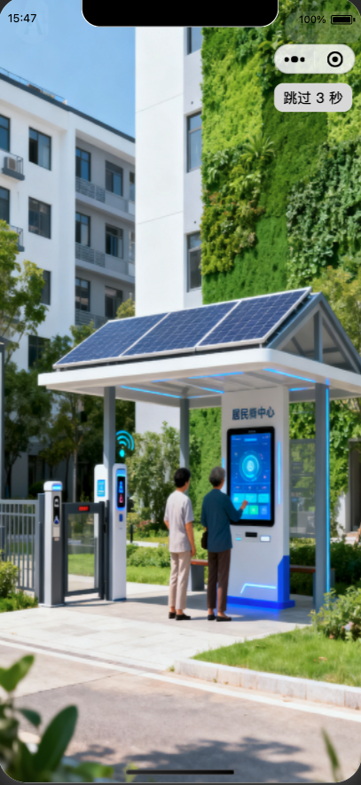
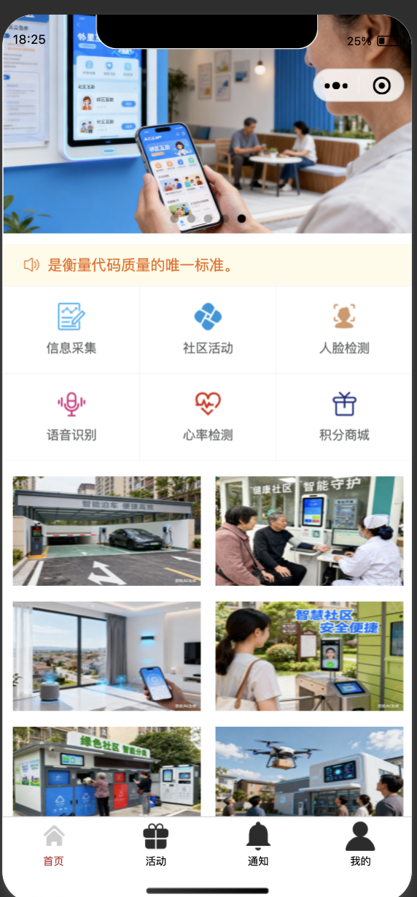
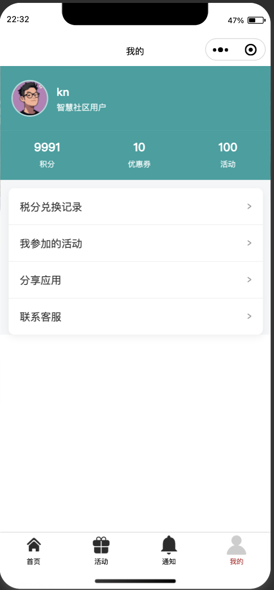

# 微信小程序项目篇

##  项目功能描述

智慧社区 小程序

```bash

- 1 欢迎背景图 
  - 默认静态图
  - 动态加载背景图
  - 3秒后自动跳转到首页
- 2 首页
  - 轮播图：动态
  - 公共栏：动态
  - 信息采集，社区活动，人脸检测，语音识别，心率检测，积分商城
- 3 信息采集页面
  - 采集人数展示
  - 采集列表
- 4 采集详情页面
  - 打开摄像头拍照：提交到后端
- 5 采集统计
- 6 人脸检测
- 7 语言识别
- 8 积分商城
- 9 活动
- 10 公告
  - 公共列表展示参
- 11 我的个人中心
  - 个人信息展示
- 登录
   
```
## 小程序中集成 vant-app 

见文档 [微信小程序接入vant-weapp.md](./微信小程序接入vant-weapp.md)

## 欢迎页面
    用一个大图片盖住，3S之后跳转到首页。

    要注意跳转的页面，要在 tabBar 中配置好 tabBar ，否则会报错。

```html
<view class="container">

<text class="jump" bind:tap="doJump"> 跳过 {{second}} 秒  </text>

<image class="img" src="{{bgImg}}"/>

</view>

```  
```js
// pages/welcome/welcome.js
Page({

  /**
   * 页面的初始数据
   */
  data: {
    second:5
  },

  doJump(){
    // 点击跳转到首页
    wx.switchTab({
      url: '/pages/index/index',
    })
  },

  /**
   * 生命周期函数--监听页面加载
   */
  onLoad(options) {
   
    var inst = setInterval(()=>{
      // 先倒计时
      this.setData({
        second: this.data.second - 1
      })
      
      // 再判断是否需要跳转
      if (this.data.second <= 0){
        // 清除定时器
        clearInterval(inst)

        // 跳转
        wx.switchTab({
          url: '/pages/index/index',
        })
      }
    }, 1000)
  },


})

```

```css
/* pages/welcome/welcome.wxss */

page{
  height: 100%;
}

.container{
  width: 100%;
  height: 100%;
}

.container .img{
  width: 100%;
  height: 100%;
}

.jump{
  font-size:  30rpx;
  position: absolute;
  left: 570rpx;
  top:180rpx;
  background-color: #dddddd;
  padding: 10rpx 20rpx;
  border-radius: 20rpx;
}
```
最终的结果如： 



### 加载后端：动态变化

服务端用 python django 框架。目前重点在学习小程序开发，后端用什么无所谓，先用 django 框架。

请求后端接口，返回一个欢迎图的地址，然后在小程序中加载这个图片。

```js
    // 请求后端接口，加载背景图
    wx.request({
      url: 'http://127.0.0.1:8000/community/welcome',
      method: 'GET',
      success: (res) => {
        console.log(res)
        if (res.data.code == 0) {
          this.setData({
            bgImg: res.data.result
          })
        }else {
          wx.showToast({
            title: "请求网络异常",
          })
        }
      }
    })
```
报了以下错误：

```
 http://127.0.0.1:8000 不在以下 request 合法域名列表中，请参考文档：https://developers.weixin.qq.com/miniprogram/dev/framework/ability/network.html(env: macOS,mp,1.06.2504030; lib: 3.10.2)
```
解决方法：

在小程序开发工具中的右上边，点击“详情” -> "本地设置" 把 “不校验合法域名、 web-view(精力域名).....” 给勾上。 


## 首页

  首页是用户进入小程序之后，看到的第一个首页，也在内容最多的一个页面。

### 轮播图：动态

```html

<!-- 轮播图-->

<view class="banner">
<!--pages/swiper/swiper.wxml-->
<swiper autoplay indicator-dots interval="5000" >  

<swiper-item>
<image src="/images/banner/banner001.png" mode="aspectFill"/>
</swiper-item>

<swiper-item>
  <image src="/images/banner/banner002.png" mode="aspectFill"/>
</swiper-item>

<swiper-item>
  <image src="/images/banner/banner003.png" mode="aspectFill"/>
</swiper-item>

<swiper-item>
  <image src="/images/banner/banner004.png" mode="aspectFill"/>
</swiper-item>

<swiper-item>
  <image src="/images/banner/banner005.png" mode="aspectFill"/>
</swiper-item>
</swiper>
</view>

```

todo : 轮播图要改为从后端加载。


### 公共栏：动态

这一个消息通知栏，最好要从后端加载消息出来。用的是 van-notice-bar 组件。

wxml 代码如下：

```html
<van-notice-bar left-icon="volume-o" >在代码阅读过程中人们说脏话的频率是衡量代码质量的唯一标准。</van-notice-bar>
```
### 主要菜单

主要有：信息采集，社区活动，人脸检测，语音识别，心率检测，积分商城
每一个菜单都是一个页面。用 van-grid 来做，如下： 

wxml 

```html 

<van-grid column-num="3">
  <van-grid-item icon="/images/menu/data.png" text="信息采集" bind:click="gotoCollection"/>
  <van-grid-item icon="/images/menu/activity.png" text="社区活动" bind:click="gotoActvity"/>
  <van-grid-item icon="/images/menu/face.png" text="人脸检测" bind:click="gotoFace"/>
  <van-grid-item icon="/images/menu/speech.png" text="语音识别" bind:click="gotoVoice"/>
  <van-grid-item icon="/images/menu/heart.png" text="心率检测" bind:click="gotoHeart"/>
  <van-grid-item icon="/images/menu/mall.png" text="积分商城" bind:click="gotoGoods"/>
</van-grid>

```
点击小图标之后，要跳转到对应的页面。通过`bind:click` 事件来实现。代码如下，要注意的是：

- 信息采集和活动是 tabBar 页面，要使用 `wx.switchTab` 来跳转。
- 其他页面都是普通页面，要使用 `wx.navigateTo` 来跳转。

```js

  gotoCollection(){
    wx.navigateTo({
      url: '/pages/collection/collection',
    })
  },
  gotoActvity(){
    wx.switchTab({
      url: '/pages/activity/activity',
    })
  },
  gotoFace(){
    wx.navigateTo({
      url: '/pages/face/face',
    })
  },
  gotoVoice(){
    wx.navigateTo({
      url: '/pages/voice/voice',
    })
  },
  gotoHeart(){
    wx.navigateTo({
      url: '/pages/heart/heart',
    })
  },
  gotoGoods(){
    wx.navigateTo({
      url: '/pages/goods/goods',
    })
  }
```

在写服务接口时，一般会按着不同的模块设置不同的接口， 如果 banner,notice 这有数据库中是两个表，很容易想到的就是两个接口。 

但是，一个页面请求多个接口，如果还是串行请求，会导致页面加载时间过长。所以，一般会考虑并行请求多个接口，然后在页面加载完成之后，再合并数据。

但是，也可以把所有的接口都聚合到一个接口中。所以，只做了一个index的接口聚合了所有的主页面的数据。

### 底部图片

目前底总分了6张图片，并没有什么逻辑，可以考虑在后端配置一个接口，返回6张图片的地址。

wxml 代码如下：

```html

<view class ="bottom">
<view>
<image src="/images/home/home_1.png" mode="scaleToFill"/> 
</view>
<view>
<image src="/images/home/home_2.png" mode="scaleToFill"/> 
</view>
<view>
<image src="/images/home/home_3.png" mode="scaleToFill"/> 
</view>
<view>
<image src="/images/home/home_4.png" mode="scaleToFill"/> 
</view>
<view>
<image src="/images/home/home_5.png" mode="scaleToFill"/> 
</view>
<view>
<image src="/images/home/home_6.png" mode="scaleToFill"/> 
</view>
</view>

```
最终整体的展示如下：




主页的上的所有数据，都是从后端加载的。
所以 js 如下： 

```js
// index.js
const settings = require('../../config/settings.js')

Page({
  data: {
    
    banner_list: [{"img":"/images/banner/banner001.png","order": 100}],
    notice_list:[{"title":"通知标题","content":"这是一条本地通知！","img":"","order": 100}],
    bottom_list:[{"img":"/images/home/home_1.png","order": 100}]
  },

  /**
   * 生命周期函数--监听页面加载
   */
  onLoad(options) {

    console.log('加载index 数据')
    
    //请求后端接口，加载主页数据
    wx.request({
      url: settings.index_url,
      method: 'GET',
      success: (res) => {
        console.log(res)
        if (res.data.code == 0) {
          var banners = res.data.data.banner_list
          
          // 对list 排序
          banners.sort((a, b) => {
            return b.sort - a.sort
          })
          
          var notices = res.data.data.notice_list
          // 对list 排序
          notices.sort((a, b) => {
            return b.sort - a.sort
          })

          var bottoms = res.data.data.bottom_list
          // 对list 排序
          bottoms.sort((a, b) => {
            return b.sort - a.sort
          })
      
          this.setData({
            banner_list: banners,
            notice_list: notices,
            bottom_list: bottoms
          })
        }else {
          console.log('请求失败:'+res.data.msg)
          wx.showToast({
            title: "请求网络异常",
          })
        }
      } 
    })
  },

  onDisplay() {
    this.setData({ show: true });
  },
  onClose() {
    this.setData({ show: false });
  },
  formatDate(date) {
    date = new Date(date);
    return `${date.getMonth() + 1}/${date.getDate()}`;
  },
  onConfirm(event) {
    this.setData({
      show: false,
      date: this.formatDate(event.detail),
    });
  },

  gotoCollection(){
    wx.navigateTo({
      url: '/pages/collection/collection',
    })
  },
  gotoActvity(){
    wx.switchTab({
      url: '/pages/activity/activity',
    })
  },
  gotoFace(){
    wx.navigateTo({
      url: '/pages/face/face',
    })
  },
  gotoVoice(){
    wx.navigateTo({
      url: '/pages/voice/voice',
    })
  },
  gotoHeart(){
    wx.navigateTo({
      url: '/pages/heart/heart',
    })
  },
  gotoGoods(){
    wx.navigateTo({
      url: '/pages/goods/goods',
    })
  }
});

```

```html

<view class="container">

<!-- 轮播图-->
<view class="banner">
<!--pages/swiper/swiper.wxml-->
<swiper autoplay indicator-dots interval="5000" >  

  <swiper-item wx:for="{{banner_list}}" wx:key="*this">
    <image src="{{item.img}}" mode="aspectFill"/>
  </swiper-item>


</swiper>
</view>
<!-- 通知-->
<van-notice-bar left-icon="volume-o" >{{notice_list[0].content}}</van-notice-bar>

<!-- 快速入口-->

<van-grid column-num="3">
  <van-grid-item icon="/images/menu/data.png" text="信息采集" bind:click="gotoCollection"/>
  <van-grid-item icon="/images/menu/activity.png" text="社区活动" bind:click="gotoActvity"/>
  <van-grid-item icon="/images/menu/face.png" text="人脸检测" bind:click="gotoFace"/>
  <van-grid-item icon="/images/menu/speech.png" text="语音识别" bind:click="gotoVoice"/>
  <van-grid-item icon="/images/menu/heart.png" text="心率检测" bind:click="gotoHeart"/>
  <van-grid-item icon="/images/menu/mall.png" text="积分商城" bind:click="gotoGoods"/>
</van-grid>

<!-- 底部-->

<view class ="bottom">
  <block wx:for="{{bottom_list}}" wx:key="*this">
    <view>
      <image src="{{item.img}}" mode="scaleToFill"/>
    </view>
  </block>
</view>

</view>
```

最后：

1、把请求后端的接口，聚合到一个配置文件中，这样方法管理， 
2、最好把请求后端的接口，也放到同一个模块中
  


## 信息采集页面
  - 采集人数展示
  - 采集列表
- 4 采集详情页面
  - 打开摄像头拍照：提交到后端
- 5 采集统计
- 6 人脸检测
- 7 语言识别
- 8 积分商城
- 9 活动
- 10 公告
  - 公共列表展示参
## 我的个人中心

- 个人信息展示




- 登录


### 纯静态页面

### 后端加载欢迎页


## 首面
## 个人中心页面


