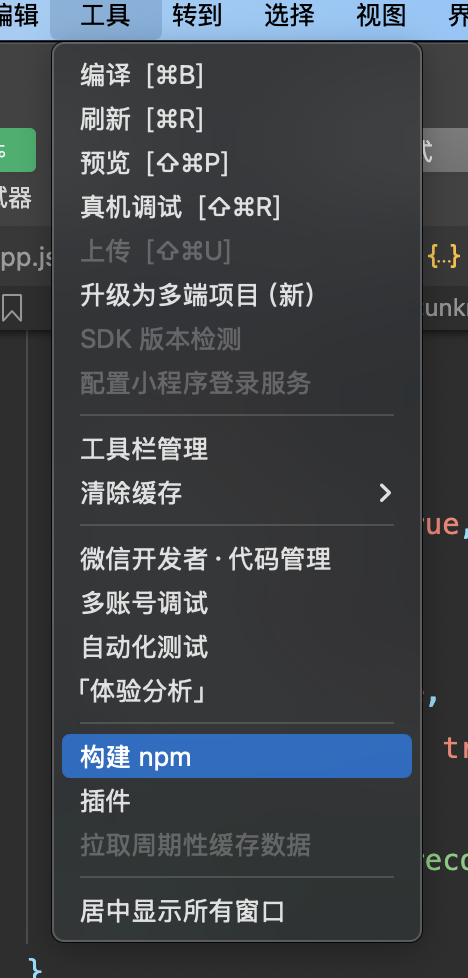
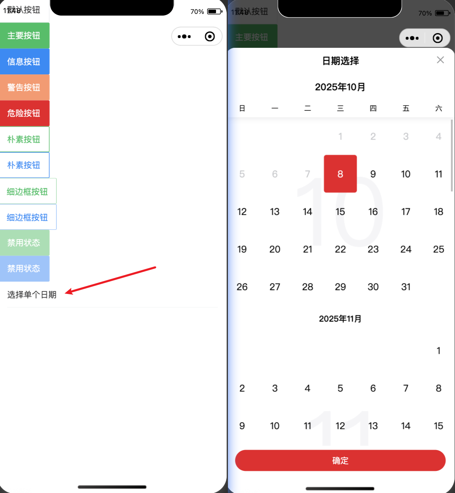

小程序上，如果我们纯自己写样式，对css要求比较高, 可以使用第三方ui库，快速构建出好看的样子

** vant-weapp **
  -  vant：有赞团队出的ui框架 
  - vue 端
  - react 端
  - 微信小程序端 [https://vant-ui.github.io/vant-weapp/#/home](https://vant-ui.github.io/vant-weapp/#/home)
  
**集成步骤**

需要让小程序支持安装 npm 包（vant-weapp） 
  - 注意：要使用专门为微信小程序提供的npm包，并不是所有第三方包都支持微信小程序
  - https://developers.weixin.qq.com/miniprogram/dev/devtools/npm.html
  - 小程序环境比较特殊，一些全局变量（如 window 对象）和构造器（如 Function 构造器）是无法使用的
  
**安装 node.js 工具 node 和 npm 工具**

我的电脑中已经安装了 node.js 和 npm工具了。 见【？？？？】

```sh 
npm init -y  # 生成 package.json 文件
```

安装 vant-weapp 包

```sh
npm install @vant/weapp -S
cnpm install @vant/weapp -S
```

删除小程序 app.json 中的 "style": "v2"

小程序的新版本基础组件强行加上了许样式，难以覆盖，不关闭将造成部分组件样式的混乱。

在  project.config.json 的   "setting": 添加 

```json  
    "packNpmManually": true,
    "packNpmManuallyList": [
      {
        "packageJsonPath" : "./package.json",
       "miniprogramNpmDistDir": "./"
      }
    ],

     
```
这个配置的意思是，当前目录下使用 package.json， 项目的根路径就是当前目录。 

最后， 点击工具，构建 npm 



可以看到构建成功，耗时多少毫秒。到这里集成成功了。 

使用 vant 样式。 

1 引入组件

可能按照官方的文档来操作，主要分三部分， 
1. 引入组件 即配置好 json 的引放
2. 引入wxml 把wxml 代码引入到对应的页面上。 
3. 引入js 把js 代码引入到对应的文件上。 

如下： 

可以 app.json 中引入组件 也可以 当前页面引入组件

```json
  "usingComponents": {
    "van-button": "@vant/weapp/button/index",
    "van-calendar": "@vant/weapp/calendar/index",
     "van-cell": "@vant/weapp/cell/index"
  },
```
在 index.wxml 中引入组件

```html 
<van-button type="default">默认按钮</van-button>
<van-button type="primary">主要按钮</van-button>
<van-button type="info">信息按钮</van-button>
<van-button type="warning">警告按钮</van-button>
<van-button type="danger">危险按钮</van-button>
<van-button plain type="primary">朴素按钮</van-button>
<van-button plain type="info">朴素按钮</van-button>

<van-button plain hairline type="primary">细边框按钮</van-button>
<van-button plain hairline type="info">细边框按钮</van-button>

<van-button disabled type="primary">禁用状态</van-button>
<van-button disabled type="info">禁用状态</van-button>

<van-cell title="选择单个日期" value="{{ date }}" bind:click="onDisplay" />
<van-calendar show="{{ show }}" bind:close="onClose" bind:confirm="onConfirm" />

```
在 index.js 文件中引入, 注意方法不能重复了，不然会报错。 

```js 
Page({
  data: {
    date: '',
    show: false,
  },

  onDisplay() {
    this.setData({ show: true });
  },
  onClose() {
    this.setData({ show: false });
  },
  formatDate(date) {
    date = new Date(date);
    return `${date.getMonth() + 1}/${date.getDate()}`;
  },
  onConfirm(event) {
    this.setData({
      show: false,
      date: this.formatDate(event.detail),
    });
  },
});
```
